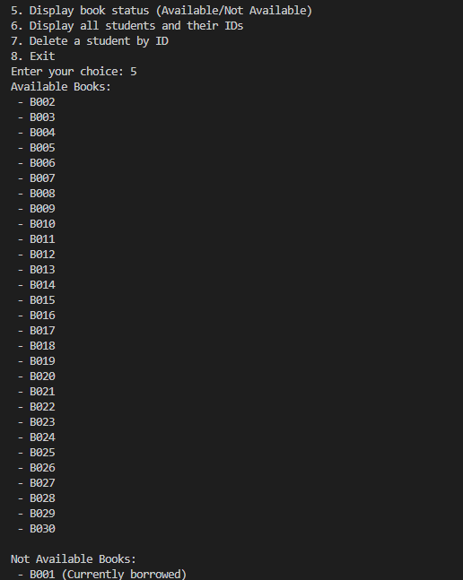

## Features
- **Add Students**: Each student has a unique library ID and can borrow up to 5 books.
- **Borrow & Return Books**: Books can be borrowed using their unique code and must be returned before being borrowed by another student.
- **Book Availability Check**: Check whether a book is available or currently borrowed.
- **Student Management**: Add, view, and delete student records.
- **Book Borrowing History**: Track books borrowed and returned by each student.

## Files
- `app.py` – Main application file.
- `database.py` – Handles the database connection and setup.
- `student.py` – Contains student-related functions (add, delete, view details).
- `book.py` – Manages book-related operations (borrow, return, availability).
- `menu.py` – Displays the menu and handles user inputs.
- `utils.py` – Utility functions (reserved for future expansions).

## Install the required dependencies:
- pip install mysql-connector-python

